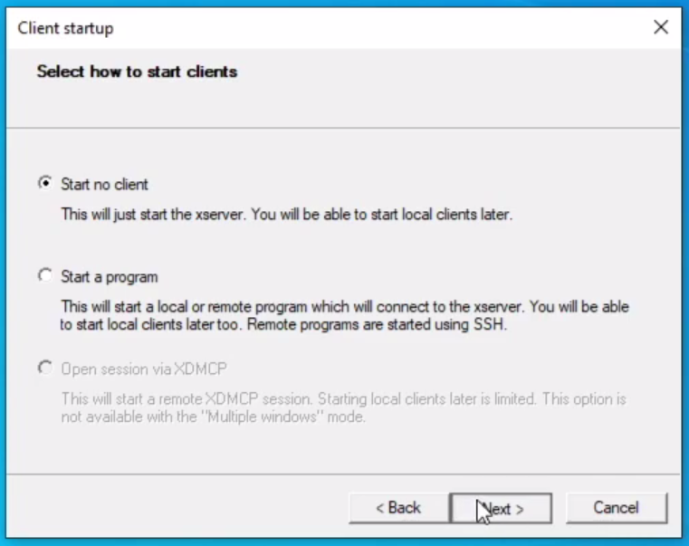
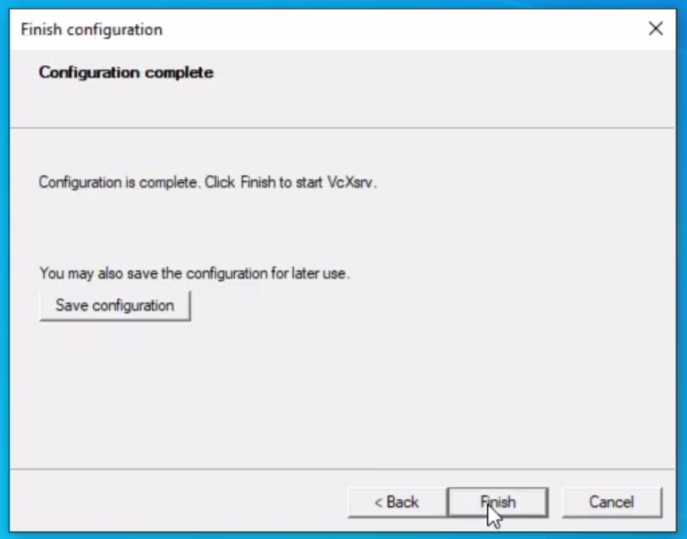

<div align="center">
   <h1>N-Puzzle</h1>
</div>


<p align="center">Artificial Intelligence course project - UniCT 2022/23</p>

<blockquote>
  <p align="center">“I visualise a time when we will be to robots what dogs are to humans, and I’m rooting for the machines.” —Claude Shannon</p>
</blockquote>


------

- **[Introduction](#Introduction)**
  
- **[Algorithms](#Algorithms)**
  
- **[Heuristics](#Heuristics)**
- **[Usage](#Usage)**
  - **[Unix](#Unix)**
  - **[Windows](#WSL)**
  - **[Docker](#Docker)**

- **[Author](#Author)**

------


## Introduction

The N-Puzzle is a type of tile puzzle that consists of a square divided into numbered tiles that must be reordered into a specific arrangement.

<p align="center">
    
    <figcaption>This is an example of a solved 15-Puzzle. The blank tile is represented by the last tile in the bottom right. The goal of the game is to move the tiles so that they are reordered in ascending order from left to right and from top to bottom.</figcaption>
</p>


The game consists of moving the tiles one at a time, using a blank tile on the board, in order to return the tiles to their original position. The difficulty of the game increases with the number of tiles and the complexity of the initial arrangement. The N-Puzzle is a classic problem in Artificial Intelligence research, as it requires finding a solution through a series of informed actions based on some knowledge of the game.


## Algorithms

Two uninformed search algorithms and three informed search algorithms have been implemented:

- BFS - breadth-first search;
- DFS - depth-first search;

- A* search;
- IDA* search - iterative deeping A* search;
- BA* search - bidirectional A* search.


## Heuristics

- Manhattan distance;
- Euclidean distance;
- Linear conflict;
- Misplaced tiles;
- Linear conflict + Manhattan Distance.


## Usage

### Unix

You can use the `init.sh` script to install all necessary package:

```bash
sudo chmod +x ./init.sh && ./init.sh
```

Then you can try:

```shell
python3 main.py --help
```

 It will return the help:

```shell
usage: main.py [-h] [--ps PS] [--ts TS]

optional arguments:
  -h, --help  show this help message and exit
  --ps PS     Size of the puzzle (e.g. 3 for a 3x3 puzzle)
  --ts TS     Size of the tiles (e.g. 50 for 50x50 pixels)
```

In order to generate a $4 \times 4$ puzzle, you can use the following command:

```shell
python3 main.py --ps 4
```

**Note:** I haven't tried to execute the code on MAC OS but the same execution procedure that applies to Linux should work without any problems.


### WSL

Download and install <a target="_blank" href="https://sourceforge.net/projects/vcxsrv/">VcXsrv</a>.

Now follow these steps:

<p align="center">
    <br>
    <br>
	<br>
	
</p>


Now use the following command:

```shell
cat /etc/resolv.conf
```

Take note of the nameserver.

<p align="center">
	
</p>

After that, you have to use these command:

```shell
cd ~ & nano .bashrc
```

At the end insert of `.bashrc` insert the following line:

```shell
export DISPLAY=<nameserver>:0.0
export LIBGL_ALWAYS_INDIRECT=1
```

Use `CTRL+O` and `RETURN` to save; `CTRL+X` and `RETURN` to exit. Then use:

```shell
source .bashrc
```

Now, you can use the `init.sh` script to install all necessary package:

```bash
sudo chmod +x ./init.sh && ./init.sh
```

Then you can try:

```shell
python3 main.py --help
```

 It will return the help:

```shell
usage: main.py [-h] [--ps PS] [--ts TS]

optional arguments:
  -h, --help  show this help message and exit
  --ps PS     Size of the puzzle (e.g. 3 for a 3x3 puzzle)
  --ts TS     Size of the tiles (e.g. 50 for 50x50 pixels)
```

In order to generate a $4 \times 4$ puzzle, you can use the following command:

```shell
python3 main.py --ps 4
```


### Docker

Download and install <a target="_blank" href="https://www.docker.com/products/docker-desktop">Docker Desktop</a> and <a target="_blank" href="https://sourceforge.net/projects/vcxsrv/">VcXsrv</a> (for [WSL](#WSL)).

Use the following commands:

```bash
docker-compose up -d
```

```bash
sudo chmod +x docker_run.sh
```

Then you can try some scripts inside **./tests**:

```bash
./docker_run.sh python3 main.py --help
```

 It will return the help:

```shell
usage: main.py [-h] [--ps PS] [--ts TS]

optional arguments:
  -h, --help  show this help message and exit
  --ps PS     Size of the puzzle (e.g. 3 for a 3x3 puzzle)
  --ts TS     Size of the tiles (e.g. 50 for 50x50 pixels)
```

In order to generate a $4 \times 4$ puzzle, you can use the following command:

```shell
./docker_run.sh python3 main.py --ps 4
```


## Author

[Seminara Luigi](https://github.com/Gigi-G)